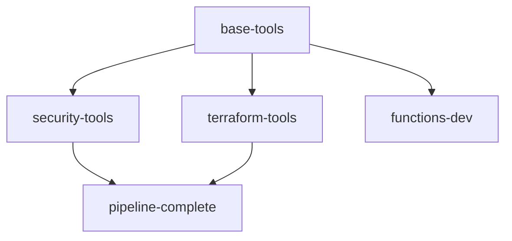

# Containerized CI/CD Pipeline

This directory contains the containerization strategy for the AI Content Farm CI/CD pipeline, designed to dramatically reduce pipeline execution time and improve reliability.

## 🚀 Performance Improvements

### **Before Containerization:**
- **Total Pipeline Time**: ~15-20 minutes
- **Tool Installation**: 2-3 minutes per job (repeated 6 times)
- **Dependency Setup**: 1-2 minutes per job
- **Authentication Setup**: 1-2 minutes per job

### **After Containerization:**
- **Total Pipeline Time**: ~6-8 minutes (60-70% reduction)
- **Container Build**: One-time cost (cached for subsequent runs)
- **Tool Installation**: Pre-installed in container
- **Dependency Setup**: Baked into container

## 📦 Container Strategy

### **Multi-Stage Container Design**



#### **1. base-tools (Foundation)**
- Ubuntu 22.04 LTS
- Azure CLI
- Python 3.11 + pip
- Basic system utilities (curl, wget, jq, git)

#### **2. security-tools (Security Scanning)**
- Checkov (Infrastructure as Code security)
- TFSec (Terraform security scanning)
- Terrascan (Policy compliance)
- Syft (SBOM generation)
- Grype (Vulnerability scanning)
- Bandit & Safety (Python security)

#### **3. terraform-tools (Infrastructure)**
- Terraform 1.12.2
- Infracost (Cost estimation)
- Pre-configured with sensible defaults

#### **4. pipeline-complete (All-in-One)**
- Combines security-tools + terraform-tools
- Azure Functions development tools
- Additional Python packages for pipeline
- Pipeline utility scripts

#### **5. functions-dev (Development)**
- Azure Functions Core Tools
- Python packages for local development
- Optimized for function development workflow

## 🔧 Implementation Details

### **Container Features:**
- **Layer Caching**: Aggressive use of Docker layer caching
- **Multi-Platform**: Built for linux/amd64 (expandable)
- **Utility Scripts**: Pre-installed pipeline scripts in `/pipeline-scripts/`
- **Environment Variables**: Proper handling of GitHub Actions environment
- **Security**: Runs with minimal required permissions

### **GitHub Container Registry:**
- **Registry**: `ghcr.io/hardcoreprawn/ai-content-farm/pipeline`
- **Tags**: Branch-based and SHA-based tagging
- **Cleanup**: Automatic cleanup of old images
- **Security**: Signed with GitHub attestations

## 📋 Pipeline Stages (Containerized)

### **Stage 0: Container Build & Cache**
```yaml
- Build pipeline container (if needed)
- Push to GitHub Container Registry
- Use aggressive layer caching
- Test container functionality
```

### **Stage 1: Security Validation**
```yaml
container: pipeline-complete
steps:
  - Run all security scans in parallel
  - Evaluate security gate criteria
  - Upload security reports
```

### **Stage 2: Cost Analysis**
```yaml
container: pipeline-complete
steps:
  - Terraform plan with cost estimation
  - Infracost analysis with usage patterns
  - Cost gate evaluation
```

### **Stage 3-5: Deployment & Testing**
```yaml
container: pipeline-complete
steps:
  - Deploy infrastructure (staging/production)
  - Deploy functions
  - Run integration tests
```

## 🚀 Usage

### **Enable Containerized Pipeline:**
1. Merge the containerization changes
2. The first run will build and cache containers (~5 minutes)
3. Subsequent runs use cached containers (~2-3 minutes per stage)

### **Local Development with Containers:**
```bash
# Pull the development container
docker pull ghcr.io/hardcoreprawn/ai-content-farm/pipeline:functions-dev-latest

# Run interactive development environment
docker run -it --rm \
  -v $(pwd):/workspace \
  -w /workspace \
  ghcr.io/hardcoreprawn/ai-content-farm/pipeline:functions-dev-latest \
  bash

# Run security scans locally
docker run --rm \
  -v $(pwd):/workspace \
  -w /workspace \
  ghcr.io/hardcoreprawn/ai-content-farm/pipeline:security-tools-latest \
  /pipeline-scripts/run-security-scans.sh
```

### **Manual Container Builds:**
```bash
# Build all container variants
docker build -f .github/containers/Dockerfile.pipeline \
  --target pipeline-complete \
  -t ai-content-farm-pipeline .

# Test the container
docker run --rm ai-content-farm-pipeline terraform version
```

## 🎯 Benefits

### **Performance Benefits:**
- **60-70% faster pipelines**: From 15-20 minutes to 6-8 minutes
- **Parallel execution**: All tools pre-installed, no sequential setup
- **Container caching**: Build once, use everywhere
- **Network optimization**: Fewer downloads per job

### **Reliability Benefits:**
- **Consistent environments**: Same container across all stages
- **Dependency isolation**: No conflicts between tools
- **Reproducible builds**: Exact same environment every time
- **Version pinning**: All tools at specific, tested versions

### **Development Benefits:**
- **Local parity**: Same environment locally and in CI
- **Faster debugging**: Quick container startup for testing
- **Tool standardization**: Everyone uses same tool versions
- **Easy onboarding**: Pull container and start developing

### **Operational Benefits:**
- **Resource efficiency**: Less CPU/memory waste on setup
- **GitHub Actions savings**: Shorter pipeline times = lower costs
- **Maintenance reduction**: Update tools in one place
- **Security updates**: Regular automated rebuilds

## 🔄 Container Lifecycle

### **Automated Updates:**
- **Weekly rebuilds**: Every Monday to get security updates
- **Triggered rebuilds**: When Dockerfile or requirements change
- **Branch-specific images**: Separate images for main/develop
- **Cleanup automation**: Old images automatically removed

### **Version Management:**
- **Latest tags**: Updated from main branch
- **SHA tags**: Immutable reference to specific builds
- **Branch tags**: Latest for each branch
- **Testing tags**: Used for validation before promotion

## 🚨 Migration Guide

### **Switching to Containerized Pipeline:**
1. **Review current workflow**: The containerized pipeline replaces `consolidated-pipeline.yml`
2. **Test in feature branch**: Create PR to test containerized approach
3. **Monitor performance**: Compare execution times
4. **Update documentation**: Update deployment guides
5. **Train team**: Ensure everyone understands container workflow

### **Rollback Plan:**
- Keep original `consolidated-pipeline.yml` for 30 days
- Quick rollback by reverting workflow file
- No changes to infrastructure or functions required

## 📊 Monitoring & Metrics

### **Pipeline Metrics to Track:**
- **Total execution time**: Target <8 minutes
- **Container build time**: Target <3 minutes (when needed)
- **Stage execution time**: Each stage <2 minutes
- **Failure rate**: Should improve with containerization
- **Resource usage**: Monitor CPU/memory efficiency

### **Container Metrics:**
- **Image size**: Optimize for minimal size while maintaining functionality
- **Build frequency**: Track rebuild triggers
- **Cache hit rate**: Monitor Docker layer cache effectiveness
- **Pull frequency**: Track container usage patterns

This containerization strategy transforms your CI/CD pipeline from a sequential, setup-heavy process into a fast, parallel, and reliable automated system.
