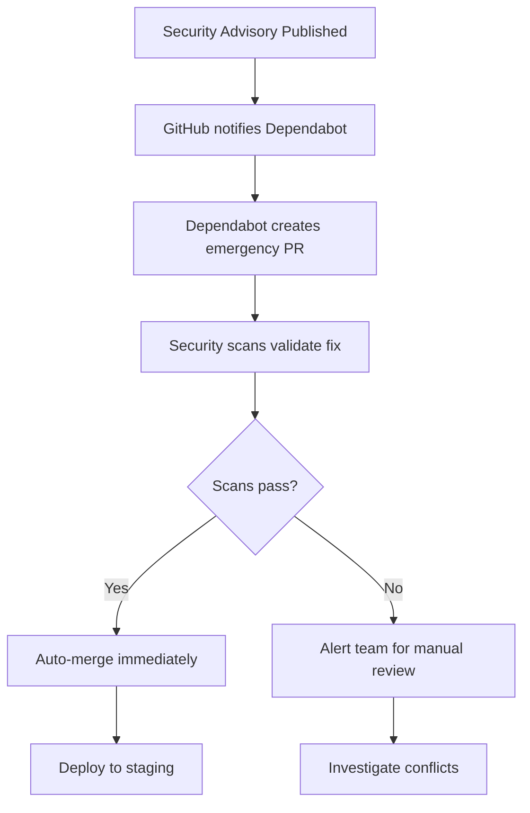

# Dependabot Integration Guide

This document explains how GitHub Dependabot integrates with our security scanning pipeline.

## 🎯 Integration Strategy

### **Dependabot + Security Scans = Defense in Depth**

**Dependabot (Prevention)** → **Security Scans (Detection)** → **Merge Protection**

### **Workflow Overview**

1. **Monday 06:00 UTC**: Dependabot creates update PRs
2. **Automatic Trigger**: Each PR triggers our full security scan suite
3. **Security Validation**: All 4 security tools validate the updates
4. **Smart Merging**: Clean scans = auto-merge, issues = developer review

## 🔧 Configuration Details

### **Current Dependabot Setup**
- **Python packages**: Weekly updates for all 8 containers + main workspace
- **Docker images**: Monthly base image updates
- **GitHub Actions**: Monthly workflow dependency updates
- **Timing**: All scheduled for Monday 06:00 UTC to batch updates

### **Security Scan Integration**
Every Dependabot PR automatically runs:
- ✅ **Trivy**: Validates container security
- ✅ **Semgrep**: Ensures code patterns remain secure
- ✅ **Safety**: Confirms no new vulnerabilities introduced
- ✅ **Checkov**: Validates infrastructure compliance

## 🚀 Recommended Workflow Enhancements

### **1. Auto-merge for Clean Scans** (Optional)
```yaml
# Add to .github/workflows/dependabot-auto-merge.yml
name: Dependabot Auto-merge
on:
  pull_request:
    types: [opened, synchronize]

jobs:
  auto-merge:
    if: github.actor == 'dependabot[bot]'
    runs-on: ubuntu-latest
    steps:
      - name: Wait for security scans
        uses: lewagon/wait-on-check-action@v1.3.1
        with:
          ref: ${{ github.event.pull_request.head.sha }}
          check-name: 'Quality Gate Summary'
          repo-token: ${{ secrets.GITHUB_TOKEN }}
          wait-interval: 30

      - name: Auto-merge if scans pass
        if: success()
        run: gh pr merge --auto --squash "$PR_URL"
        env:
          PR_URL: ${{ github.event.pull_request.html_url }}
          GITHUB_TOKEN: ${{ secrets.GITHUB_TOKEN }}
```

### **2. Priority Labels for Security Updates**
Dependabot PRs are automatically labeled based on update type:
- `dependencies` - All dependency updates
- `python` - Python package updates  
- `docker` - Container base image updates
- `github-actions` - Workflow dependency updates
- Container-specific labels for targeted review

### **3. Vulnerability Response Protocol**


## 📊 Benefits

### **Reduced Security Debt**
- **Before**: Manual dependency updates, quarterly security reviews
- **After**: Automated weekly updates, continuous security validation

### **Faster Incident Response** 
- **Detection**: Safety catches vulnerabilities in current dependencies
- **Resolution**: Dependabot already has update PR ready
- **Validation**: Security scans ensure fix doesn't break anything
- **Deployment**: Automated merge and deployment

### **Developer Experience**
- **Less manual work**: Dependabot handles routine updates
- **Clear decisions**: Security scans provide clear pass/fail
- **Focused attention**: Only review PRs that fail security scans

## 🔍 Monitoring & Metrics

Track these metrics to measure effectiveness:

### **Security Metrics**
- Time from CVE publication to fix deployment
- Number of vulnerable dependencies in production
- False positive rate from security scans

### **Operational Metrics**  
- Dependabot PR success rate (auto-merged vs manual)
- Security scan execution time trends
- Developer time spent on dependency management

## 🛠️ Troubleshooting

### **Common Scenarios**

**Q: Dependabot PR fails security scan**
**A:** 
1. Check if new dependency introduces vulnerability (Safety)
2. Verify code patterns remain secure (Semgrep)
3. Ensure container security maintained (Trivy)
4. Manual review required - don't auto-merge

**Q: Too many Dependabot PRs**
**A:**
1. Consider reducing frequency for non-critical containers
2. Group updates by ecosystem
3. Use auto-merge for patch versions only

**Q: Security scan takes too long**
**A:**
1. Our optimized 4-tool stack should run in 6-8 minutes
2. Consider parallel execution if needed
3. Cache scan results for unchanged components

## 🔮 Future Enhancements

1. **Severity-based Auto-merge**: Critical security updates auto-merge, feature updates require review
2. **Container-specific Policies**: Different update frequencies per service criticality
3. **Integration with Azure Security Center**: Cross-reference with cloud security posture
4. **Custom Dependabot Rules**: Skip updates that historically cause test failures

---
*Last updated: August 21, 2025*
