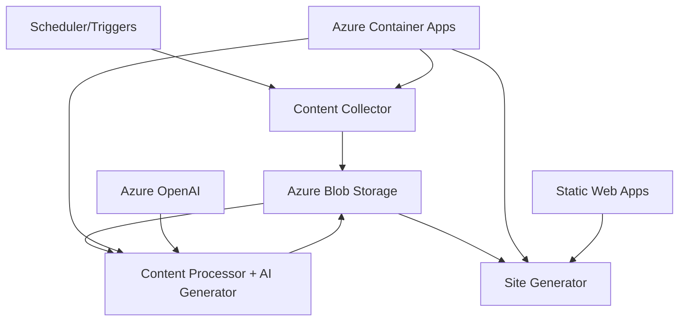

# AI Content Farm - System Architecture & Standards

## Overview

The AI Content Farm is a cloud-native, event-driven content curation and publishing system built with a simplified 3-container microservices architecture. Each component is containerized and communicates through well-defined APIs and Azure Blob Storage.

## Architecture Principles

### 1. **Cloud-Native Design**
- All data storage uses Azure Blob Storage
- No persistent local file systems or volumes
- Environment-specific configuration via environment variables
- Stateless container design

### 2. **Event-Driven Architecture**
- Services communicate through blob storage triggers and HTTP APIs
- Each service watches for specific blob patterns to trigger processing
- Loose coupling between services
- Async processing where appropriate

### 3. **Consistent Container Standards**
- All containers follow the same structure and patterns
- Standardized health checks and logging
- Common base configuration and error handling
- Unified blob storage integration

## System Components (Simplified 3-Container Architecture)



**Flow**: Reddit/Web → Content Collector → Content Processor (Enhanced) → Site Generator → jablab.com

### Architecture Evolution
- **Before**: 4+ containers with unclear data flow
- **After**: 3 containers with clear responsibilities and 25% complexity reduction
- **Zero Regression**: All functionality preserved during consolidation

## Container Standards

### Port Allocation
- **8001**: Content Collector
- **8002**: Content Processor (Enhanced with AI Generation)
- **8003**: Site Generator

## Container Specifications

### 1. Content Collector
**Purpose**: Collect and normalize content from Reddit and other sources
**Port**: 8001
**Endpoints**:
- `GET /health` - Health check
- `GET /status` - Detailed status
- `POST /api/collector/collect` - Trigger content collection

**Data Flow**:
- Reads: Reddit API, external sources
- Writes: `collected-content/` container in blob storage

### 2. Content Processor (Enhanced)
**Purpose**: Process raw content AND generate AI-powered articles
**Port**: 8002
**Endpoints**:
- `GET /health` - Health check
- `GET /status` - Detailed status
- `POST /api/processor/process` - Content processing
- `POST /api/processor/generate/tldr` - Generate TLDR articles
- `POST /api/processor/generate/blog` - Generate blog posts
- `POST /api/processor/generate/deepdive` - Generate detailed analysis
- `POST /api/processor/generate/batch` - Batch generation

**Data Flow**:
- Reads: `collected-content/` container
- Writes: `processed-content/` container
- AI Integration: Azure OpenAI for content generation

### 3. Site Generator
**Purpose**: Generate static HTML sites from processed content
**Port**: 8003
**Endpoints**:
- `GET /health` - Health check
- `GET /status` - Detailed status
- `POST /api/site-generator/generate` - Generate static site

**Data Flow**:
- Reads: `processed-content/` container
- Writes: `static-sites/` container
- Deploys: Azure Static Web Apps

## Blob Storage Containers

| Container | Purpose | Format | Access Pattern |
|-----------|---------|---------|---------------|
| `collected-content` | Raw content from sources | JSON | Write: Collector, Read: Processor |
| `processed-content` | Processed + AI-generated content | JSON | Write: Processor, Read: Site Generator |
| `static-sites` | Generated HTML sites | ZIP/TAR | Write: Site Generator, Deploy: Static Web Apps |
| `pipeline-logs` | Processing logs and metrics | JSON | Write: All, Read: Monitoring |

## Standard API Patterns

All containers implement consistent API patterns:

### Health & Status
```
GET /health      # Quick health check
GET /status      # Detailed service status
GET /docs        # OpenAPI documentation
```

### Service Endpoints
```
POST /api/{service}/{action}  # Main business logic
GET  /api/{service}/status    # Service-specific status
```

### Response Format
```json
{
  "status": "success|error",
  "message": "Human readable message",
  "data": { /* response data */ },
  "metadata": { /* service metadata */ }
}
```

## Deployment Architecture

### Azure Container Apps
- **Environment**: ai-content-prod-env
- **Containers**: 3 independent apps
- **Scaling**: 0-3 replicas per container (cost-optimized)
- **Authentication**: Managed identity for Azure services

### Azure Services Integration
- **Storage**: Azure Blob Storage for all data persistence
- **AI**: Azure OpenAI for content generation
- **Monitoring**: Application Insights for logging and metrics
- **Deployment**: Azure Static Web Apps for site hosting
- **Security**: Key Vault for secrets management

## Development Workflow

### 1. Local Development
```bash
# Start all containers
docker-compose up -d

# Test the pipeline
./test-pipeline.sh
```

### 2. Testing Flow
```bash
# 1. Collect content
curl -X POST "http://localhost:8001/api/collector/collect"

# 2. Process content + generate AI articles
curl -X POST "http://localhost:8002/api/processor/generate/blog" \
  -H "Content-Type: application/json" \
  -d '{"topic": "AI trends", "source_material": "..."}'

# 3. Generate static site
curl -X POST "http://localhost:8003/api/site-generator/generate"
```

### 3. Production Deployment
- **CI/CD**: GitHub Actions with Azure Container Apps deployment
- **Infrastructure**: Terraform for Azure resource management
- **Monitoring**: Cost tracking and performance metrics
- **Security**: Automated vulnerability scanning

## Security Standards

### Authentication
- **Azure**: Managed identity for all Azure service access
- **External APIs**: Key Vault for API keys and secrets
- **Container-to-Container**: Internal networking via Container Apps environment

### Data Protection
- **Storage**: Azure Blob Storage with encryption at rest
- **Transit**: HTTPS for all external communications
- **Secrets**: Azure Key Vault integration
- **Logging**: No sensitive data in logs

### Access Control
- **Network**: IP restrictions on Container Apps ingress
- **RBAC**: Least privilege access for managed identities
- **Secrets**: Rotation and secure injection

## Monitoring & Observability

### Health Monitoring
- **Container Health**: Built-in health checks for all containers
- **Dependency Health**: Blob storage, Azure OpenAI connectivity
- **Performance**: Response times and throughput metrics

### Cost Monitoring
- **Budget Alerts**: $40/month limit with automated notifications
- **Resource Usage**: Container scaling and storage costs
- **AI Costs**: Token usage and model costs tracking

### Logging
- **Structured Logging**: JSON format for all containers
- **Centralized**: Application Insights aggregation
- **Correlation**: Request tracking across container boundaries

## Scaling Strategy

### Container Scaling
- **Baseline**: 0 replicas (scale-to-zero for cost efficiency)
- **Auto-scaling**: Based on request load and queue depth
- **Maximum**: 3 replicas per container (cost control)

### Storage Scaling
- **Hot Storage**: Recent content and active processing
- **Cool Storage**: Archived content and historical data
- **Cleanup**: Automated retention policies

### Cost Optimization
- **Consumption-based**: Pay only for active processing time
- **Resource Limits**: CPU and memory constraints per container
- **Regional**: UK South deployment for cost and compliance

---

## Quick Reference

### Architecture Summary
- **3 Containers**: Collector → Processor (Enhanced) → Site Generator
- **Cloud-Native**: Azure Container Apps + Blob Storage + OpenAI
- **Event-Driven**: Blob storage triggers and HTTP APIs
- **Cost-Efficient**: Scale-to-zero with $40/month budget

### Key Features
- **Simplified**: 25% complexity reduction from previous architecture
- **Enhanced**: Content processor now includes AI generation capabilities
- **Reliable**: Graceful fallbacks and error handling
- **Scalable**: Auto-scaling with cost controls
- **Secure**: Managed identity and Key Vault integration

### Next Steps
1. **Testing**: End-to-end pipeline validation
2. **Monitoring**: Cost and performance tracking setup
3. **Documentation**: API documentation and developer guides
4. **Optimization**: Performance tuning and cost optimization  
- **8003**: Content Enricher
- **8004**: Content Ranker
- **8005**: Static Site Generator
- **8006**: Markdown Converter (deprecated - functionality moved to SSG)
- **8007**: Markdown Generator
- **8008**: Scheduler
- **8009**: Web Interface

### Required Endpoints
Every container MUST implement:

```http
GET /health
GET /
GET /status
```

### Required Environment Variables
```bash
ENVIRONMENT=development|staging|production
AZURE_STORAGE_CONNECTION_STRING=<connection-string>
 # PYTHONPATH is no longer set at runtime in containers
```

### Container Structure
```
container-name/
├── Dockerfile
├── requirements.txt
├── main.py              # FastAPI application
├── config.py            # Configuration management
├── blob_storage.py      # Blob storage client
├── business_logic.py    # Core functionality
└── tests/
    └── test_*.py
```

## Data Flow & Storage Containers

### Blob Storage Containers

| Container Name | Purpose | Content Type | Access Pattern |
|---------------|---------|--------------|----------------|
| `collected-content` | Raw content from sources | JSON | Write: Collector, Read: Processor |
| `processed-content` | Cleaned/normalized content | JSON | Write: Processor, Read: Enricher |
| `enriched-content` | AI-analyzed content | JSON | Write: Enricher, Read: Ranker |
| `ranked-content` | Scored/ranked content | JSON | Write: Ranker, Read: Markdown Gen |
| `markdown-content` | Generated markdown files | Markdown | Write: Markdown Gen, Read: SSG |
| `static-sites` | Generated websites | HTML/CSS/JS | Write: SSG, Read: Web Interface |
| `pipeline-logs` | System logs and metrics | JSON | Write: All, Read: Monitoring |
| `cms-exports` | CMS-ready exports | Various | Write: CMS Exporters, Read: External |

### Blob Naming Convention
```
{service-name}_{timestamp}_{content-type}_{unique-id}.{extension}

Examples:
- collector_20250818_120000_reddit_batch_001.json
- enricher_20250818_120015_ai_analysis_batch_001.json
- markdown_20250818_120030_curated_articles.md
- ssg_20250818_120045_website_v1.zip
```

## API Standards

### Response Format
All APIs MUST use consistent response format:

```json
{
  "status": "success|error|processing",
  "message": "Human readable message",
  "data": {...},
  "metadata": {
    "timestamp": "2025-08-18T12:00:00Z",
    "service": "service-name",
    "version": "1.0.0",
    "request_id": "uuid"
  },
  "errors": [...] // Only present if status is "error"
}
```

### Health Check Response
```json
{
  "status": "healthy|unhealthy|degraded",
  "timestamp": "2025-08-18T12:00:00Z",
  "service": "service-name",
  "version": "1.0.0",
  "dependencies": {
    "azure_storage": "healthy",
    "upstream_service": "healthy"
  },
  "metrics": {
    "uptime_seconds": 3600,
    "requests_processed": 150,
    "last_activity": "2025-08-18T11:59:30Z"
  }
}
```

### Error Handling
```json
{
  "status": "error",
  "message": "Brief error description",
  "errors": [
    {
      "code": "VALIDATION_ERROR",
      "message": "Detailed error message",
      "field": "field_name",
      "details": {...}
    }
  ],
  "metadata": {
    "timestamp": "2025-08-18T12:00:00Z",
    "service": "service-name",
    "request_id": "uuid"
  }
}
```

## Service Specifications

### 1. Content Collector
**Purpose**: Gather content from external sources (Reddit, RSS, APIs)

**Blob Storage**:
- Writes to: `collected-content`
- Blob pattern: `collector_{timestamp}_{source}_{batch_id}.json`

**Key Endpoints**:
```http
POST /collect/reddit
POST /collect/rss
GET /sources
GET /collection/status/{batch_id}
```

**Configuration**:
```bash
REDDIT_CLIENT_ID=<reddit-api-key>
REDDIT_CLIENT_SECRET=<reddit-secret>
RSS_SOURCES=<comma-separated-urls>
COLLECTION_SCHEDULE=<cron-expression>
```

### 2. Content Processor
**Purpose**: Clean, normalize, and validate collected content

**Blob Storage**:
- Reads from: `collected-content`
- Writes to: `processed-content`
- Blob pattern: `processor_{timestamp}_{batch_id}.json`

**Key Endpoints**:
```http
POST /process/batch
GET /processing/status/{batch_id}
```

**Processing Steps**:
1. Content validation and sanitization
2. Duplicate detection and removal
3. Schema normalization
4. Quality scoring

### 3. Content Enricher
**Purpose**: Add AI analysis, topic classification, sentiment analysis

**Blob Storage**:
- Reads from: `processed-content`
- Writes to: `enriched-content`
- Blob pattern: `enricher_{timestamp}_{analysis_type}_{batch_id}.json`

**Key Endpoints**:
```http
POST /enrich/batch
GET /enrichment/status/{batch_id}
```

**AI Services**:
- OpenAI for summaries and analysis
- Topic classification
- Sentiment analysis
- Trend detection

### 4. Content Ranker
**Purpose**: Score and rank content using multiple factors

**Blob Storage**:
- Reads from: `enriched-content`
- Writes to: `ranked-content`
- Blob pattern: `ranker_{timestamp}_{ranking_algorithm}_{batch_id}.json`

**Key Endpoints**:
```http
POST /rank/batch
GET /ranking/top/{limit}
GET /ranking/status/{batch_id}
```

**Ranking Factors**:
- Engagement metrics (40%)
- Content freshness (35%)
- Topic relevance (25%)

### 5. Markdown Generator
**Purpose**: Convert ranked content to markdown format

**Blob Storage**:
- Reads from: `ranked-content`
- Writes to: `markdown-content`
- Blob pattern: `markdown_{timestamp}_{format}_{batch_id}.md`

**Key Endpoints**:
```http
POST /generate/batch
GET /generation/status/{batch_id}
```

**Output Formats**:
- Individual article markdown files
- Index/listing files
- CMS-ready frontmatter

### 6. Static Site Generator
**Purpose**: Create deployable websites from markdown content

**Blob Storage**:
- Reads from: `markdown-content`
- Writes to: `static-sites`
- Blob pattern: `ssg_{timestamp}_{theme}_{version}.tar.gz`

**Key Endpoints**:
```http
POST /generate/site
GET /sites/{site_id}
GET /preview/{site_id}
```

**Site Features**:
- Responsive design
- Search functionality
- RSS feeds
- SEO optimization

## Event-Driven Triggers

### Blob Watch Patterns
Each service watches specific blob patterns to trigger processing:

```python
# Example trigger configuration
TRIGGER_PATTERNS = {
    "content-processor": "collected-content/collector_*",
    "content-enricher": "processed-content/processor_*", 
    "content-ranker": "enriched-content/enricher_*",
    "markdown-generator": "ranked-content/ranker_*",
    "static-site-generator": "markdown-content/markdown_*"
}
```

### Processing Flow
```
1. Collector writes → collected-content/collector_20250818_120000_reddit_001.json
2. Processor detects new blob → processes → writes processed-content/processor_20250818_120015_001.json  
3. Enricher detects new blob → enriches → writes enriched-content/enricher_20250818_120030_001.json
4. Ranker detects new blob → ranks → writes ranked-content/ranker_20250818_120045_001.json
5. Markdown Generator detects new blob → generates → writes markdown-content/markdown_20250818_120100_001.md
6. SSG detects new blob → builds site → writes static-sites/ssg_20250818_120115_v1.tar.gz
```

## Configuration Management

### Environment-Specific Settings
```bash
# Development (Azurite)
ENVIRONMENT=development
AZURE_STORAGE_CONNECTION_STRING=DefaultEndpointsProtocol=http;AccountName=devstoreaccount1;...

# Staging
ENVIRONMENT=staging  
AZURE_STORAGE_CONNECTION_STRING=DefaultEndpointsProtocol=https;AccountName=aicontentfarmstaging;...

# Production
ENVIRONMENT=production
AZURE_STORAGE_CONNECTION_STRING=DefaultEndpointsProtocol=https;AccountName=aicontentfarm;...
```

### Service Discovery
Services discover each other through:
1. Docker network (local development)
2. Azure Service Bus (production)
3. Configuration-based URLs

## Monitoring & Observability

### Logging Standards
```python
# Required log fields
{
  "timestamp": "2025-08-18T12:00:00Z",
  "service": "content-enricher", 
  "level": "INFO|ERROR|DEBUG|WARN",
  "message": "Human readable message",
  "request_id": "uuid",
  "blob_name": "enricher_20250818_120000_001.json",
  "processing_time_ms": 1500,
  "metadata": {...}
}
```

### Metrics Collection
- Processing latency per service
- Blob storage operations
- Error rates and types
- Content quality scores
- System resource usage

### Health Monitoring
- Service health checks every 30s
- Dependency health validation
- Automated alerting on failures
- Performance threshold monitoring

## Development Workflow

### Local Development
1. Start Azurite for blob storage
2. Run containers with development configuration
3. Use test data for pipeline validation
4. Monitor logs for debugging

### Testing Strategy
- Unit tests for business logic
- Integration tests for blob storage
- End-to-end pipeline tests
- Performance/load testing

### Deployment Pipeline
1. Code review and approval
2. Automated testing
3. Container image builds
4. Deployment to staging
5. Production deployment with blue/green strategy

## Security Considerations

### Access Control
- Service-to-service authentication via managed identities
- Blob storage access with SAS tokens
- API rate limiting and throttling
- Input validation and sanitization

### Data Protection
- Encryption at rest (Azure Storage)
- Encryption in transit (HTTPS/TLS)
- Sensitive data handling (credentials, API keys)
- Data retention policies

## Scalability & Performance

### Horizontal Scaling
- Stateless container design enables easy scaling
- Load balancing across container instances
- Auto-scaling based on blob storage queue depth
- Resource optimization per service

### Performance Targets
- Content processing: < 5 seconds per batch
- AI enrichment: < 30 seconds per batch  
- Site generation: < 60 seconds for full site
- API response times: < 500ms for health checks

## Future Enhancements

### Planned Features
- Real-time content streaming
- Advanced AI models for content analysis
- Multi-language support
- Enhanced CMS integrations
- Advanced analytics and reporting

### Architecture Evolution
- Migration to Azure Functions for serverless execution
- Event Grid for advanced event routing
- Cosmos DB for metadata and configuration
- CDN integration for site delivery

---

This architecture provides a robust, scalable, and maintainable foundation for the AI Content Farm system while maintaining clear separation of concerns and consistent standards across all components.
