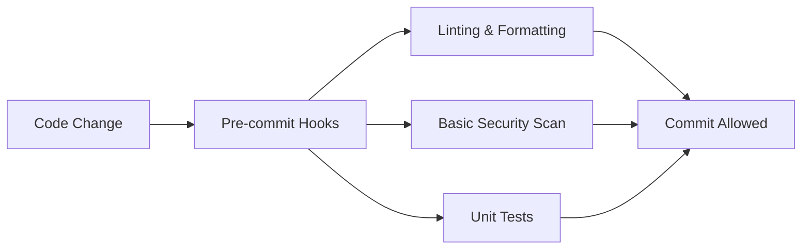
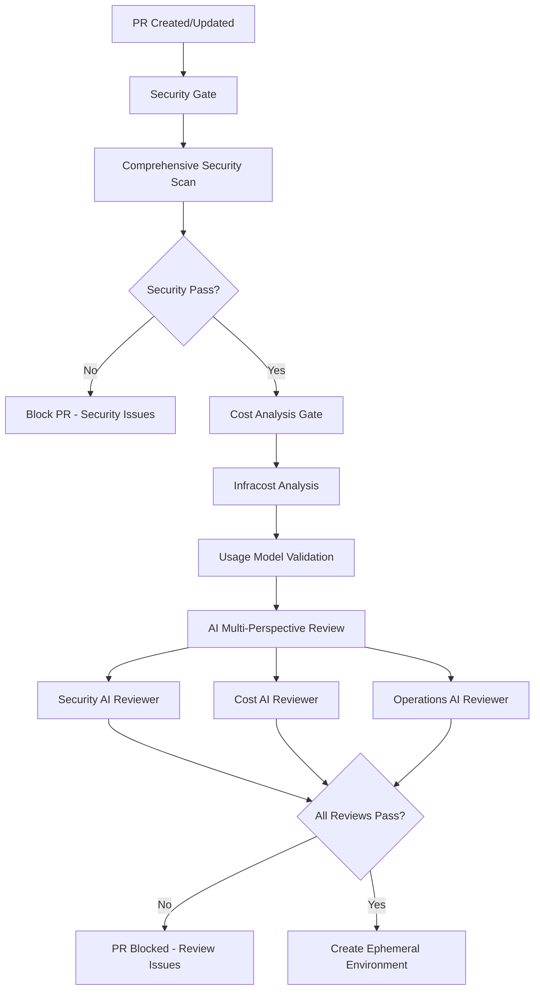
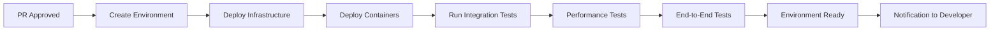
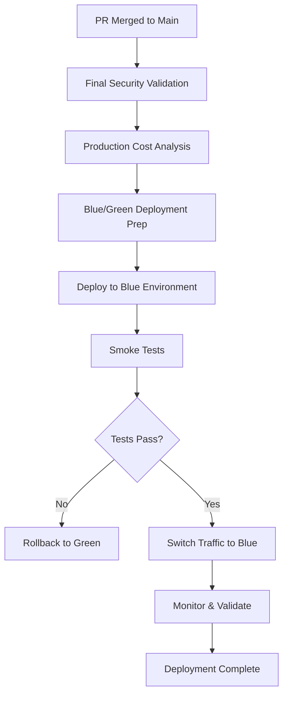
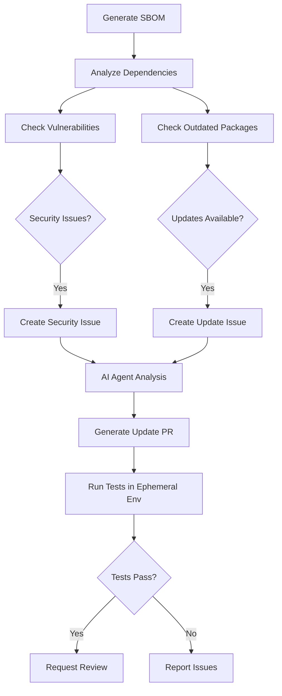

# AI-Enhanced CI/CD Pipeline Design
## Modern DevOps with Multi-Perspective AI Code Review

### 🎯 **Vision**
Create a comprehensive CI/CD pipeline that combines security scanning, cost modeling, and multi-perspective AI code review to ensure high-quality, secure, and cost-effective deployments with rapid feedback loops.

---

## 📋 **Core Requirements**

### **Security-First Approach**
- Security tools run on every commit
- Only secured code reaches PR environments
- Comprehensive scanning before any deployment
- Security-focused AI reviewer validates security practices

### **Cost Intelligence**
- Infracost analysis on infrastructure changes
- Usage model-based cost projections
- Cost-focused AI reviewer evaluates financial impact
- Future: Usage data feeds back into cost models

### **Rapid Iteration**
- Fast feedback on PR changes
- Quick environment provisioning for testing
- Operations-focused AI reviewer ensures reliability
- Easy research and iteration workflow

### **Infrastructure as Code**
- All infrastructure defined in code
- Configuration drift detection and correction
- Versioned infrastructure changes
- Auditable deployment history

---

## 🏗️ **Pipeline Architecture**

### **1. Pre-Commit Stage (Local/Git Hooks)**


**Tools & Actions:**
- `pre-commit` hooks with security linting
- Python/Terraform formatting (black, terraform fmt)
- Basic secret detection (gitleaks, detect-secrets)
- Fast unit tests only

---

### **2. PR Creation Stage**


**Security Gate:**
- Checkov (Infrastructure security)
- Trivy (Container & dependency scanning)
- Terrascan (Policy compliance)
- SAST tools (Semgrep/CodeQL)
- **SBOM Generation & Analysis** (Syft + custom vulnerability assessment)

**Cost Analysis Gate:**
- Infracost infrastructure cost estimation
- Usage pattern analysis
- Budget impact assessment
- Resource optimization recommendations

**Dependency Management:**
- **Software Bill of Materials (SBOM)** generation for all containers
- **Vulnerability scanning** against CVE databases
- **Outdated package detection** with update recommendations
- **Automated GitHub issue creation** for security vulnerabilities
- **AI-powered dependency updates** (future enhancement)

**AI Review Panel:**
- **Security AI**: Reviews for security best practices, vulnerability patterns, access controls
- **Cost AI**: Analyzes resource usage, cost optimization opportunities, efficiency patterns
- **Operations AI**: Evaluates reliability, monitoring, scalability, and operational complexity

---

### **3. Ephemeral Environment Stage**


**Environment Characteristics:**
- Isolated Azure resource group per PR
- Scaled-down versions of production services
- Cost-optimized configuration (smaller SKUs)
- Automatic cleanup on PR close/merge
- Full observability and logging

---

### **4. Production Deployment Stage**


---

## 🤖 **AI-Powered Dependency Management**

### **Automated Dependency Agent**
**Role**: Proactive dependency management and security maintenance

**Capabilities:**
- **SBOM Analysis**: Generate and analyze Software Bill of Materials for all containers
- **Vulnerability Detection**: Scan dependencies against CVE databases and security advisories
- **Update Assessment**: Evaluate package updates for compatibility and security impact
- **Automated PR Creation**: Generate pull requests with tested dependency updates
- **Risk Assessment**: Prioritize updates based on security impact and stability

### **Dependency Analysis Workflow**


### **Dependency AI Agent Specifications**

**Analysis Areas:**
- Security vulnerability assessment and prioritization
- Package compatibility and breaking change analysis
- Update impact on system performance and stability
- Dependency tree analysis for cascading effects
- License compatibility checking
- Maintenance status of dependencies

**Output Format:**
```markdown
## Dependency Update Analysis
**Priority**: [CRITICAL/HIGH/MEDIUM/LOW]
**Type**: [SECURITY/MAINTENANCE/FEATURE]

### 📦 Package Updates
- **Package**: {package_name}
- **Current Version**: {current_version}
- **Target Version**: {target_version}
- **Change Type**: [MAJOR/MINOR/PATCH]

### 🔒 Security Impact
- **Vulnerabilities Fixed**: {count}
- **CVE Numbers**: {list}
- **Risk Reduction**: {assessment}

### ⚡ Compatibility Assessment
- **Breaking Changes**: {analysis}
- **API Changes**: {summary}
- **Testing Requirements**: {recommendations}

### 🎯 Recommendations
- [Specific update strategy]
- [Testing approach]
- [Rollback plan]

### 📋 Automated Actions Taken
- [List of automated updates applied]
- [Test results summary]
- [Compatibility verification]
```

### **Implementation Components**

**SBOM Generation (Implemented):**
- Containerized Syft for consistent SBOM generation
- JSON output for all containers and shared libraries
- Infrastructure component tracking

**Vulnerability Analysis:**
- Integration with OSV (Open Source Vulnerabilities) database
- CVE database checking
- GitHub Security Advisory monitoring
- Custom vulnerability pattern detection

**Update Automation:**
```python
# Dependency Agent Features
class DependencyAgent:
    def analyze_update_safety(self, package, from_version, to_version):
        # Analyze changelog for breaking changes
        # Check API compatibility
        # Assess test coverage impact
        
    def create_update_pr(self, updates):
        # Generate optimized requirements.txt updates
        # Create comprehensive test plan
        # Include rollback instructions
        
    def validate_in_environment(self, pr_number):
        # Deploy to ephemeral environment
        # Run full test suite
        # Performance impact assessment
```

---

## 📋 **Dependency Management Integration**

### **Daily Automated Checks**
- SBOM generation and analysis
- Vulnerability database updates
- Security advisory monitoring
- Automated issue creation for critical vulnerabilities

### **Weekly Maintenance**
- Comprehensive dependency update assessment
- Non-critical update PR generation
- Performance impact analysis
- License compliance verification

### **Emergency Response**
- Critical vulnerability immediate response
- Zero-day vulnerability assessment
- Emergency patch deployment pipeline
- Security incident documentation

---

## 🤖 **AI Reviewer Specifications**

### **Security AI Reviewer**
**Role**: Security-focused code analysis and recommendations

**Analysis Areas:**
- Authentication and authorization patterns
- Secret management and Key Vault usage
- Network security and access controls
- Container security best practices
- Infrastructure security configuration
- Dependency vulnerabilities
- OWASP compliance

**Output Format:**
```markdown
## Security Review Summary
**Overall Risk Level**: [LOW/MEDIUM/HIGH/CRITICAL]

### ✅ Security Strengths
- [List of good security practices found]

### ⚠️ Security Concerns
- [Specific issues with line numbers and recommendations]

### 🔒 Recommendations
- [Actionable security improvements]

### 📋 Compliance Check
- OWASP Top 10: [Status]
- Azure Security Baseline: [Status]
- Container Security: [Status]
```

### **Cost AI Reviewer**
**Role**: Financial impact analysis and optimization recommendations

**Analysis Areas:**
- Resource sizing and optimization
- Cost-effective service choices
- Usage pattern efficiency
- Scaling configuration impact
- Budget alignment
- Cost per feature/capability
- ROI on infrastructure choices

**Output Format:**
```markdown
## Cost Impact Review
**Estimated Monthly Cost Change**: $[amount] ([percentage]% change)

### 💰 Cost Analysis
- Current monthly estimate: $[amount]
- Projected monthly estimate: $[amount]
- Annual impact: $[amount]

### 📊 Resource Efficiency
- [Analysis of resource utilization]
- [Optimization opportunities]

### 💡 Cost Optimization Recommendations
- [Specific ways to reduce costs]
- [Alternative service suggestions]

### 📈 Usage Model Alignment
- [How changes align with expected usage patterns]
```

### **Operations AI Reviewer**
**Role**: Reliability, maintainability, and operational excellence

**Analysis Areas:**
- Monitoring and observability
- Error handling and resilience
- Scalability patterns
- Maintenance complexity
- Deployment reliability
- Recovery procedures
- Performance implications

**Output Format:**
```markdown
## Operations Review
**Operational Readiness**: [EXCELLENT/GOOD/NEEDS_WORK/RISKY]

### 🎯 Reliability Assessment
- [Analysis of system reliability patterns]

### 📊 Observability Review
- Monitoring coverage: [percentage]%
- Alert configuration: [status]
- Logging adequacy: [assessment]

### 🔧 Maintenance Impact
- [Assessment of operational complexity]
- [Maintenance burden analysis]

### 🚀 Scalability Review
- [Performance implications]
- [Scaling behavior analysis]

### 📝 Recommendations
- [Operational improvements]
- [Monitoring enhancements]
- [Reliability improvements]
```

---

## 🛠️ **Implementation Plan**

### **Phase 1: Foundation (Week 1)**
- [ ] Set up GitHub Actions workflows
- [ ] Configure security scanning tools (Checkov, Trivy, Terrascan)
- [ ] Implement Infracost integration
- [ ] Create basic ephemeral environment scripts

### **Phase 2: AI Integration (Week 2)**
- [ ] Implement Security AI Reviewer
- [ ] Implement Cost AI Reviewer  
- [ ] Implement Operations AI Reviewer
- [ ] **Implement Dependency AI Agent**
- [ ] **Set up vulnerability database integration**
- [ ] Create review aggregation and reporting

### **Phase 3: Ephemeral Environments (Week 3)**
- [ ] Azure resource group automation
- [ ] Container deployment automation
- [ ] Test suite integration
- [ ] Cleanup automation

### **Phase 4: Production Pipeline (Week 4)**
- [ ] Blue/green deployment setup
- [ ] Production monitoring integration
- [ ] Rollback procedures
- [ ] Performance validation

---

## 📁 **File Structure**

```
.github/
├── workflows/
│   └── cicd-pipeline.yml             # Unified CI/CD pipeline with modular actions
├── actions/                          # Modular GitHub Actions
│   ├── security-scan/                # Security scanning action
│   ├── cost-analysis/                # Cost analysis action  
│   ├── ai-review-security/           # AI security review action
│   ├── ai-review-cost/               # AI cost review action
│   ├── ai-review-operations/         # AI operations review action
│   ├── deploy-ephemeral/             # Ephemeral environment deployment
│   └── cleanup-ephemeral/            # Environment cleanup action
├── scripts/
│   ├── ai-reviewers/
│   │   ├── security-reviewer.py      # Security AI logic
│   │   ├── cost-reviewer.py          # Cost AI logic
│   │   ├── operations-reviewer.py    # Operations AI logic
│   │   └── review-aggregator.py      # Combine all reviews
│   ├── deploy-ephemeral.sh           # Ephemeral env deployment
│   ├── cleanup-ephemeral.sh          # Environment cleanup
│   └── blue-green-deploy.sh          # Production deployment
└── templates/
    ├── pr-review-template.md          # Review output template
    └── deployment-summary.md          # Deployment report template
```

---

## 🎯 **Success Metrics**

### **Security**
- Zero critical vulnerabilities in production
- 100% security scan pass rate for merged PRs
- Mean time to security fix < 24 hours

### **Cost**
- Infrastructure cost variance < 10% from estimates
- Cost per feature deployment tracked and optimized
- Monthly cost trending and analysis

### **Operations**
- Deployment success rate > 99%
- Mean time to deployment < 30 minutes
- Rollback time < 5 minutes when needed

### **Developer Experience**
- PR feedback time < 15 minutes
- Environment provisioning time < 10 minutes
- Clear, actionable AI review feedback

---

## 🔄 **Feedback Loops**

### **Continuous Improvement**
- AI reviewer accuracy tracking and tuning
- Cost model refinement based on actual usage
- Security pattern learning from incidents
- Developer feedback integration

### **Usage Data Integration**
- Actual resource usage → Cost model updates
- Performance data → Operations recommendations
- Security incidents → Enhanced scanning rules
- Developer feedback → AI reviewer improvements

---

**This design provides a comprehensive, AI-enhanced CI/CD pipeline that ensures security, cost-effectiveness, and operational excellence while enabling rapid iteration and learning.**
